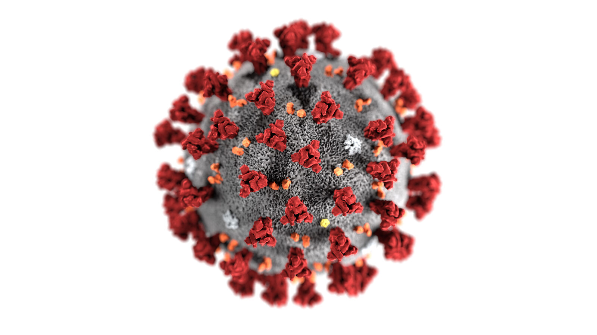

```{r setup, include=FALSE}
knitr::opts_chunk$set(echo = TRUE, fig.align="center")
library(tidyverse)
library(ggrepel)
library(GGally)
library(ggmosaic)
```

# Introduction

While COVID has affected almost everyone in the US and around the world, it is clear that the pandemic’s impact has not been felt equally. Americans of lower socioeconomic status before the pandemic have been disproportionately impacted by unemployment, food and housing insecurity, and health issues in the past year. As economic recovery policies are being created and implemented, it is important to know how measures like stimulus packages should be targeted to help those who have dealt with the most extreme impacts of COVID-19. In order to help serve this need, this project explores how different demographic and economic health variables can predict a variety of impacts of the pandemic. 



# Project Overview

This project uses the same COVID Impact Survey data as our [Shiny app](https://maggie-smth.shinyapps.io/COVID-proj/), which we chose for the ability to explore relationships between different variables in a deeper and more meaningful way. The survey was administered by the Data Foundation, a non-governmental organization, and focuses on physical health, economic and food security, and unemployment. This survey included 2,047 adults was conducted from May 30th to June 8th using a sample drawn from NORC’s probability-based AmeriSpeak Panel, which is designed to be representative of the U.S. population. The data, and more information about the COVID Impact Survey, is available [here](https://www.covid-impact.org). 

In order to expand on our Shiny app analysis, we wanted to explore more holistic relationships in the data by making complex comparisons between multiple variables at once. We used k-means clustering to form groupings in the data based on similarities in a few variables, and then continued our analysis by determining whether these clusters could predict the values of other variables. Because the clusters were designed to group respondents by the degree to which they’d felt particular impacts of the pandemic, we compared them to both demographic variables as well as other economic health variables. This allowed us to further explore which variables in the dataset best predict impacts of COVID-19 on individual economic health.

# Clustering Analysis

One of the first steps we took was determining which variables would be best to use in the formation of the clusters. We had two primary requirements in mind: (a) variables have to be numeric and ordinal, and (b) variables should have enough variation to form clusters that are sufficiently different from each other. Because our data was based on a survey, almost all the variables were categorical. We chose variables that could be coerced into a numeric format, either because the question required the respondent to rate themselves on a scale or because the question had a set of other ordered, categorical answers. The variables we ended up including in the clustering were:

* Age (which has seven answers each of which included a range)
* Household Income (which is structured similar to age with nine categories)
* Education (which has seven answers related to various levels of schooling)
* Short-Term Employment Confidence (the respondent’s level of confidence that they would be employed in 30 days)
* Long-Term Employment Confidence (the respondent’s level of confidence that they would be employed in three months) 
   - Note: both the Employment Confidence variables required the respondent rate themselves on a scale from one to five, with one being “Extremely likely”
  
Next, we created an elbow plot to compare the number of clusters with inter-cluster variation. We were looking for an “elbow” in the graph’s line where there would be a sharp decrease in the change in inter-cluster variation as the number of clusters increases. The point where this elbow occurs signals the optimal number of clusters for the data.

```{r}
kmeans_data <- read.csv("~/git/Blog-Girls-Who-Code/kmeans_data.csv") 

# Creating elbow plot

fig <- matrix(NA, nrow=15, ncol=2)

set.seed(75)
for (i in 1:15){
  fig[i,1] <- i
  fig[i,2] <- kmeans(kmeans_data
                    , centers=i
                    , nstart=20)$tot.withinss
}

ggplot(data = as.data.frame(fig), aes(x = V1, y = V2)) +
  geom_point() + 
  geom_line() +
  scale_x_continuous(breaks=c(1:15)) +
  labs(x = "K", y = expression("Total W"[k]))

# Performing kmeans clustering analysis with various numbers of centroids

set.seed(23)
km2_out <- kmeans(kmeans_data, centers = 2, nstart = 20)
km2_out$centers

kmeans_data2 <- kmeans_data %>%
  mutate(clust2 = as.character(km2_out$cluster))

set.seed(23)
km4_out <- kmeans(kmeans_data, centers = 4, nstart = 20)
km4_out$centers

kmeans_data2 <- kmeans_data2 %>%
  mutate(clust4 = as.character(km4_out$cluster))

set.seed(23)
km5_out <- kmeans(kmeans_data, centers = 5, nstart = 20)
km5_out$centers

kmeans_data2 <- kmeans_data2 %>%
  mutate(clust5 = as.character(km5_out$cluster))

set.seed(23)
km7_out <- kmeans(kmeans_data, centers = 7, nstart = 20)
km7_out$centers

kmeans_data2 <- kmeans_data2 %>%
  mutate(clust7 = as.character(km7_out$cluster))

set.seed(23)
km11_out <- kmeans(kmeans_data, centers = 11, nstart = 20)
km11_out$centers

kmeans_data2 <- kmeans_data2 %>%
  mutate(clust11 = as.character(km11_out$cluster))

```

As we can see, there’s not a clear elbow in the plot for our data. While the decrease in inter-cluster variation definitely isn’t constant, the change decreases fairly steadily. We decided to perform the rest of our analysis using four clusters because the change in inter-cluster variation seems to decrease more noticeably after that point and the centroids of the clusters are more varied than the centroids of larger numbers of clusters.

We then created a pairs diagram to examine the differences between the clusters. Unfortunately, it’s difficult to determine a clear pattern in the scatter and density plots. In order to understand how the clusters were formed, we created separate density plots to simplify the pairs diagram.


```{r}
# Creating pairs diagram 

vars <- c("ECON4A", "ECON4B", "HHINCOME", "EDUCATION", "AGE7")

ggpairs(data = kmeans_data2
        , aes(color = clust4) 
        , columns = vars
        , upper = list(continuous = "blank"))
```

While the original pairs diagram didn’t contain a lot of helpful information about the clusters, it was clear that income and age were driving variables in the cluster assignment (because the variation between clusters was most clear in the density plots for those variables). In order to explore clustering with these two variables more in-depth, we re-created the density plots while faceting by cluster assignment. 

```{r}
# Adding cluster assignments to dataset with all variables of interest (relevant later)

post_cluster_vars <- read.csv("~/git/Blog-Girls-Who-Code/post_cluster_data.csv")
  
alL_vars_data <- post_cluster_vars %>% 
  left_join(kmeans_data2, by = "AGE7") 

# Creating density plots

ggplot(alL_vars_data, aes(x = HHINCOME, group = clust4, fill = clust4)) +
    geom_density(adjust=3) + 
  labs(title = "Distribution of Income by Cluster", 
       x = "Income", 
       y = "Density",
       fill = "Cluster Assignment") + 
  facet_wrap(~clust4)
```


As we can see, clusters one and four are fairly similar, they both contain respondents that have higher incomes. Clusters two and three contain respondents with lower incomes, with cluster three containing a wider variation.

```{r}
ggplot(alL_vars_data, aes(x = AGE7, group = clust4, fill = clust4)) +
    geom_density(adjust=3) +
  labs(title = "Distribution of Age by Cluster", 
       x = "Age Group", 
       y = "Density",
       fill = "Cluster Assignment") +
  facet_wrap(~clust4)
```


With the age distribution, the similar cluster pairs change. Clusters one and three seem to be closely related, with cluster three containing a slightly higher number of young respondents. On the other hand, clusters two and four contain older respondents.

```{r}
ggplot(data = alL_vars_data, aes(x=ECON4A, group = clust4, fill=clust4)) +
  geom_density(adjust = 5) +
  labs(title = "Distribution of ECON4A Answers by Cluster", 
       x = "ECON4A Answers", 
       y = "Density",
       fill = "Cluster Assignment") +
  facet_wrap(~clust4)

ggplot(data = alL_vars_data, aes(x=ECON4B, group = clust4, fill=clust4)) +
  geom_density(adjust = 5) +
  labs(title = "Distribution of ECON4B Answers by Cluster", 
       x = "ECON4B Answers", 
       y = "Density",
       fill = "Cluster Assignment") +
  facet_wrap(~clust4)
```

In the density plot comparing cluster assignment and both of the employment likelihood variables, it’s clear that clusters one and three are quite similar, as are clusters two and four. Clusters two and four are less confident as whole about their future employment, whereas clusters one and three are less confident. One notable difference between clusters one and three, in the graph for 30 day employment confidence, is that cluster three is more spread out across the variable, whereas cluster one contains more confident respondents.

# Post-Clustering Analysis

After performing our clustering analysis, we explored the relationship between different demographic and economic health variables and cluster assignment. First, we examined the proportions of categorical demographic variable responses across clusters. The following demographic variables were used in this investigation:

* Gender: Male or Female
* Racial Background: Black (non-Hispanic), Hispanic, Other (non-Hispanic), White (non-Hispanic)
* Population Density: Rural, Suburban, Urban

Shown in the plots below, the proportions of both gender and population density responses did not differ substantially across clusters. In other words, all four clusters were made up of a similar proportion of male and female respondents; approximately 40% of respondents were male and approximately 60% of respondents were female across all clusters. Additionally, all four clusters were made up of a similar proportion of respondents from rural, suburban, and urban environments; approximately 75% of respondents lived in an urban environment, approximately 20% of respondents lived in a suburban environment, and approximately 5% of respondents lived in a rural environment across all clusters. Therefore, these visualizations demonstrate that cluster assignment does not predict variation in gender and population density of respondents.

```{r}
ggplot(alL_vars_data, aes(x = clust4, fill = GENDER2)) +
  geom_bar(position = "fill") +
  labs(title = "Gender Proportions by Cluster Assignment", 
       x = "Cluster Assignment", 
       y = "Proportion",
       fill = "Gender") 

ggplot(alL_vars_data, aes(x = clust4, fill = P_DENSE2)) +
  geom_bar(position = "fill") +
  labs(title = "Population Density Proportions by Cluster Assignment", 
       x = "Cluster Assignment", 
       y = "Proportion",
       fill = "Population Density")
```

Unlike the plots above, the plot below shows how the proportions of reported racial background differed across clusters. For instance, the red, green and blue bars are similar and thicker in clusters one and three than in clusters two and four. These findings suggest that respondents from clusters one and three reported a Black-non-Hispanic background, a Hispanic background, or another non-Hispanic background at a higher rate than participants in clusters two and four. Additionally, the purple bars are similar and thicker in clusters two and four than in clusters one and three. This result implies that respondents in clusters two and four reported a White, non-Hispanic background at a higher rate than respondents in clusters one and three. As different patterns in the proportions of reported racial background emerged, this visualization demonstrates that cluster assignment can predict interesting differences in reported racial background. It also shows that respondents from clusters one and three report similar racial background proportions and that respondents from clusters two and four report similar racial background proportions.

```{r}
ggplot(alL_vars_data, aes(x = clust4, fill = RACETH2)) +
  geom_bar(position = "fill") +
  labs(title = "Racial Background Proportions by Cluster Assignment", 
       x = "Cluster Assignment", 
       y = "Proportion",
       fill = "Racial Background")
```

After exploring the relationship between our categorical demographic variables and cluster assignment, we investigated the proportions of responses to individual economic health questions across clusters. We used the following economic health variables in this investigation:

* Unemployment Insurance
  - Question: In the past 7 days, have you either received, applied for, or tried to apply for any of the following forms of income or assistance, or not?
* TANF (Temporary Assistance for Needy Families) 
  - In the past 7 days, have you either received, applied for, or tried to apply for any of the following forms of income or assistance, or not?
* Food Security
  - Please indicate whether the following statement was often true, sometimes true, or never true for you or your household over the past 30 days: “The food that we bought just didn't last, and we didn't have money to get more.”
  
The plot below shows that the proportion of responses to the TANF status question did not differ greatly across clusters. The blue and the purple bars are slightly greater in clusters one and three, indicating that respondents in these clusters were slightly more likely to have tried to apply for TANF or to have received TANF. However, as over 95% of participants reported that they did not apply for TANF across all four clusters, cluster assignment does not predict interesting variation in TANF status.

```{r}
ggplot(alL_vars_data, aes(x = clust4, fill = ECON6C_2)) +
  geom_bar(position = "fill") +
  labs(title = "Proportions of TANF Status by Cluster Assignment", 
       x = "Cluster Assignment", 
       y = "Proportion",
       fill = "TANF Status")
```

The next visualization, presented below, demonstrates how the proportion of responses to the unemployment insurance questions change across clusters. The blue bars are larger in clusters one and three than in clusters two and four. This finding indicates that clusters one and three received unemployment insurance at a higher rate than respondents in clusters two and four. The purple bar is also largest in cluster three, indicating that respondents in cluster three tried to apply for unemployment insurance at a higher rate than respondents in the other clusters. However, as approximately 90% of respondents in each cluster did not apply for unemployment insurance, cluster assignment does not predict very interesting patterns of unemployment insurance status.

```{r}
ggplot(alL_vars_data, aes(x = clust4, fill = ECON6A_2)) +
  geom_bar(position = "fill") +
  labs(title = "Proportions of Unemployment Insurance Status by Cluster
       Assignment", 
       x = "Cluster Assignment", 
       y = "Proportion",
       fill = "Unemployment Insurance Status")
```

Our final visualization illustrates the relationship between cluster assignment and the proportions of reported levels of food security. As can be seen below, the blue and green bars are thicker in clusters one and three and the red bars are thicker in clusters two and four. This variance in proportion of reported food security levels suggests that respondents in clusters one and three ran out of food due to financial problems at a higher rate than participants in clusters two and four. Therefore, cluster assignment is able to predict interesting differences in proportions of reported levels of food security.

```{r}
ggplot(alL_vars_data, aes(x = clust4, fill = ECON5A_B2)) +
  geom_bar(position = "fill") +
  labs(title = "Proportions of Food Security Levels Status by Cluster Assignment", 
       x = "Cluster Assignment", 
       y = "Proportion",
       fill = "Level of Food Security")
```

# Limitations & Extensions 

There are several aspects of the current data which limit the scope of our results. First, the data for this survey was collected from May to June of 2020, less than three months after COVID-19 was declared a global pandemic. This pandemic has evolved in many ways since June and its impact on the economy has changed accordingly. Therefore, the results of this project only reflect the early impact of the pandemic on individual economic health and more research is necessary to determine longer term effects. Also, as this data was collected after the pandemic began, it is hard to compare individual economic well-being before and after COVID-19. While the current findings indicate the economic health of respondents during the pandemic, without a comparison to pre-pandemic numbers, we are unable to definitively say that any of economic health trends found were caused by the COVID-19 pandemic.

In addition, the coercion of categorical variables during our clustering-analysis limits the findings of this project. While were interested in performing clustering-analysis for this project, our data primarily consists of categorical variables. As clustering-analysis can only be performed on numeric variables with quantitative meaning, we had to coerce some of our original categorical variables to have numeric values. This allowed us to successfully perform clustering-analysis, however, our clusters may have been more definitive and meaningful if we had been able to perform this analysis with truly quantitative variables.

To expand upon this research in the future, we have several suggestions. First, it would be interesting to find pre-pandemic data which includes individual economic health questions like the ones asked in the COVID-Impact survey. By comparing data like this with data from the COVID-Impact survey, researchers would be able to determine the true impacts of COVID-19 on individual economic health more definitively. Next, it would be valuable to follow up with respondents to the COVID-Impact survey each year for five years. This would allow researchers to track and analyze the longer-term impacts of the pandemic on individual economic health. Finally, it would be useful collect quantitative data on individual economic health in the future by asking individuals to report numbers such as current salary and current amount of debt. Doing so would allow researchers to make stronger conclusions based on clustering-analysis.

# Conclusion

In conclusion, both our clustering analysis and our post-clustering analysis provide interesting insights about the impact of COVID-19 on individual economic health. Through our clustering analysis, we discovered that groups of individuals were similar in their responses to questions concerning future employment confidence, age group and income bracket. With our post-clustering analysis, we learned that cluster assignment predicted interesting levels of variance in racial background and level of food security among groups of respondents. As economic recovery policies are being created and implemented, it is important that researchers continue to strive to fully understand the impact of COVID-19. This understanding will inform the development and implementation of stimulus packages which will help those who have dealt with and are still dealing with the most extreme impacts of the pandemic.

# Bibliography

Data: 

1. Anand Parekh, Nancy Potok, Charlie Rothwell and Elena Manresa (2021). COVID Impact Survey. https://www.covid-impact.org

Packages: 

1. Barret Schloerke, Di Cook, Joseph Larmarange, Francois Briatte, Moritz Marbach, Edwin Thoen, Amos Elberg and Jason Crowley (2021). GGally: Extension to 'ggplot2'. R package version 2.1.1. https://CRAN.R-project.org/package=GGally
  
2. Haley Jeppson, Heike Hofmann and Di Cook (2021). ggmosaic: Mosaic Plots in the 'ggplot2' Framework. R package version 0.3.3. https://CRAN.R-project.org/package=ggmosaic

3. Kamil Slowikowski (2021). ggrepel: Automatically Position Non-Overlapping Text Labels with 'ggplot2'. R package version 0.9.1. https://CRAN.R-project.org/package=ggrepel 
  
4. Wickham et al., (2019). Welcome to the tidyverse. Journal of Open Source Software, 4(43), 1686, https://doi.org/10.21105/joss.01686
